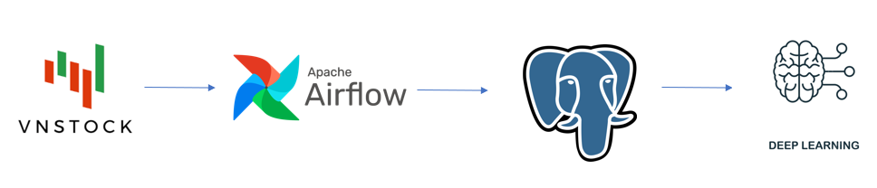

# Automated Process for Stock Data Collection and Analysis

## Table of Contents

1. [Introduction](#introduction)
2. [System Architecture](#system-architecture)
3. [Technologies](#technologies)
4. [Getting Started](#getting-started)

## Introduction

This project focuses on automating the process of collecting stock data and using that data to train a deep learning model. The goal is to build a model that can predict future stock prices based on available market information.

## System Architecture



## Technologies

- [Apache Airflow](https://airflow.apache.org/)
- [Python](https://www.python.org/)
- [PostgreSQL](https://www.postgresql.org/)
- [Docker](https://www.docker.com/)

## Getting Started

1. **Clone the repository:**

    ```bash
    https://github.com/dn-duongnam/stock-analyst.git
    ```

2. **Navigate to the project directory:**

    ```bash
    cd stock-analyst
    ```

3. **Run Docker Compose to spin up the services:**

    ```bash
    docker-compose up
    ```

This will set up and start the necessary services for the project.
